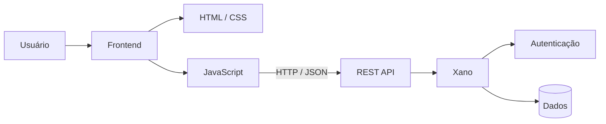
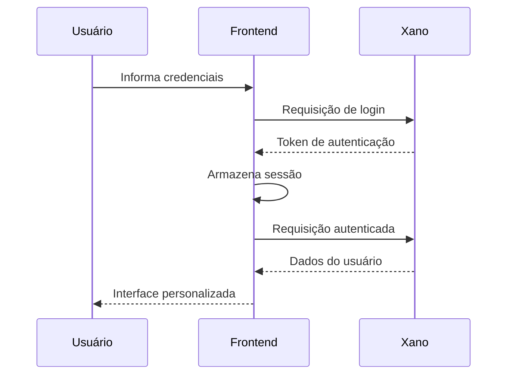

<div align="center">

# 🎓 EduTrack AI

**Gestão acadêmica inteligente: disciplinas, tarefas e progresso dos estudos em um só lugar.**


*Projeto da disciplina **Innovation Lab** — Faculdade Impacta · 2026*

</div>


## ✦ Sobre o projeto

**EduTrack AI** é uma aplicação web desenvolvida para auxiliar estudantes na **organização, acompanhamento e planejamento da rotina acadêmica**.

A proposta é reunir em um único ambiente informações que normalmente ficam espalhadas entre anotações, planilhas e diferentes ferramentas, proporcionando uma visão mais clara das disciplinas, atividades e progresso acadêmico.

Mais do que um sistema de gerenciamento, o projeto busca explorar como **tecnologia, dados e inteligência podem contribuir para uma experiência acadêmica mais organizada e eficiente.**

---

## ◇ A ideia

A rotina universitária envolve diferentes tipos de informação:

```text
                 ┌─────────────────────┐
                 │      EDU TRACK       │
                 └──────────┬──────────┘
                            │
        ┌───────────────────┼───────────────────┐
        │                   │                   │
    Disciplinas          Tarefas             Progresso
        │                   │                   │
        └───────────────────┼───────────────────┘
                            │
                   ┌────────▼────────┐
                   │ Visão acadêmica │
                   │    integrada    │
                   └─────────────────┘
```

O EduTrack busca transformar essas informações em uma experiência centralizada, permitindo que o estudante acompanhe sua rotina de maneira mais organizada e visual.

---

## ✦ Funcionalidades

### 🔐 Autenticação

Sistema de acesso integrado ao backend, permitindo:

* Cadastro de usuários
* Login
* Logout
* Recuperação de senha
* Redefinição de senha
* Controle de sessão
* Consulta de informações do usuário autenticado

---

### 📚 Disciplinas

Gerenciamento das disciplinas cadastradas pelo estudante.

**É possível:**

* Criar disciplinas
* Editar informações
* Excluir registros
* Pesquisar por disciplina ou professor
* Registrar professor e carga horária
* Adicionar descrições e observações
* Visualizar quantidade de disciplinas
* Acompanhar carga horária total

---

### 📊 Dashboard

Uma visão geral da rotina acadêmica.

O dashboard apresenta informações como:

* Progresso geral
* Tarefas concluídas
* Tarefas pendentes
* Próximas atividades
* Estimativa de tempo de estudo
* Informações relacionadas às disciplinas

A proposta é transformar dados acadêmicos em **informações fáceis de interpretar rapidamente**.

---

## ◇ Experiência

O projeto foi pensado para que o usuário consiga passar por diferentes etapas da rotina acadêmica sem precisar alternar entre múltiplas ferramentas.

```text
     LOGIN
       │
       ▼
   DASHBOARD
       │
   ┌───┴───────────────┐
   ▼                   ▼
DISCIPLINAS          TAREFAS
   │                   │
   └─────────┬─────────┘
             ▼
       ACOMPANHAMENTO
             │
             ▼
        PROGRESSO
```

---

## ✦ Tecnologias

### Frontend

<p>
  
  
  
</p>

Responsáveis pela estrutura, apresentação visual, interações e lógica da aplicação.

### Backend & Dados

<p>
  
  
</p>

O **Xano** é utilizado como backend da aplicação, fornecendo:

* APIs REST
* Autenticação
* Persistência de dados
* Endpoints protegidos
* Gerenciamento das informações da aplicação

### Ferramentas

<p>
  
  
  
</p>

Também foram utilizados **OpenSpec** e ferramentas de apoio ao desenvolvimento baseado em especificações.

---

## ✦ Arquitetura

O EduTrack utiliza uma arquitetura separando a camada de apresentação dos serviços responsáveis pelo processamento e armazenamento dos dados.



### Fluxo de autenticação



---

## ✦ Estrutura do projeto

```text
edutrack-ai-julia/
│
├── .github/          # Configurações do GitHub
├── .xano/            # Configurações relacionadas ao Xano
│
├── apis/             # APIs e endpoints
├── addons/           # Recursos auxiliares
├── agents/           # Agentes e configurações
├── css/              # Estilos da aplicação
├── docs/             # Documentação
├── functions/        # Funções do backend
├── js/               # Scripts JavaScript
├── openspec/         # Especificações do projeto
├── pages/             # Páginas da aplicação
├── scripts/          # Scripts auxiliares
├── tables/           # Estruturas de dados
├── tools/            # Ferramentas auxiliares
│
├── index.html        # Página inicial
├── dashboard.html    # Dashboard principal
│
├── AGENTS.md         # Diretrizes de desenvolvimento
├── CLAUDE.md         # Configurações para agentes
└── README.md         # Documentação
```

---

## ✦ Desenvolvimento orientado por especificações

Uma das características do projeto é a utilização de uma abordagem **Spec-Driven Development**, apoiada pelo **OpenSpec**.

Em vez de iniciar diretamente pela implementação, as funcionalidades são organizadas a partir de especificações que ajudam a definir:

```text
Requisito
   ↓
Especificação
   ↓
Planejamento
   ↓
Implementação
   ↓
Validação
```

Essa abordagem contribui para um desenvolvimento mais organizado e facilita o acompanhamento das mudanças realizadas no projeto.

---

## ✦ Segurança

A aplicação utiliza autenticação baseada em tokens fornecida pelo Xano.

Entre os mecanismos utilizados estão:

* Autenticação de usuários
* Rotas protegidas
* Token Bearer nas requisições
* Controle de sessão
* Validação de respostas da API
* Logout e remoção da sessão local

> **Nota:** o armazenamento do token no `localStorage` é adequado para o contexto acadêmico atual, mas uma aplicação destinada à produção exigiria uma análise de segurança mais aprofundada, incluindo estratégias de proteção contra XSS e gerenciamento seguro de sessão.

---

## ✦ Aprendizados

O desenvolvimento do EduTrack proporcionou a aplicação prática de conhecimentos em diferentes áreas do desenvolvimento de software.

### Desenvolvimento

* HTML
* CSS
* JavaScript
* Manipulação do DOM
* Consumo de APIs REST
* Requisições HTTP
* JSON

### Backend

* Xano
* Autenticação
* APIs
* Estruturação de dados
* Integração frontend/backend

### Engenharia de software

* Git e GitHub
* Organização de código
* Especificação de requisitos
* Versionamento
* Documentação
* Desenvolvimento orientado por especificações

Além da parte técnica, o projeto também envolve **análise de requisitos, planejamento, trabalho acadêmico e tomada de decisões durante o desenvolvimento**.

---

## ✦ Roadmap

O projeto continua aberto para evolução.

### Próximas possibilidades

* [ ] Aprimorar o gerenciamento de tarefas
* [ ] Tornar os indicadores acadêmicos totalmente dinâmicos
* [ ] Expandir os relatórios de desempenho
* [ ] Melhorar a experiência mobile
* [ ] Evoluir os recursos de planejamento acadêmico
* [ ] Explorar aplicações de inteligência artificial
* [ ] Melhorar a personalização da experiência do estudante

---

## ✦ Contexto acadêmico

**EduTrack AI** foi desenvolvido como parte da disciplina **Innovation Lab**, na **Faculdade Impacta**, durante o ano de **2026**.

O projeto representa uma oportunidade de aplicar conhecimentos de desenvolvimento web, integração de APIs, organização de dados e engenharia de software em uma solução voltada para um problema real do cotidiano acadêmico.

---

## ✧ Desenvolvedora

### Julia Neves

Estudante de **Ciência da Computação**, com interesse em desenvolvimento de software, tecnologia e inovação.

<p>
  <a href="https://github.com/JuliaDNeves">
    
  </a>
  <a href="https://www.linkedin.com/in/juliadneves/">
    
  </a>
</p>

---

<p align="center">

**EduTrack AI**

*Organize. Acompanhe. Evolua.*

</p>
