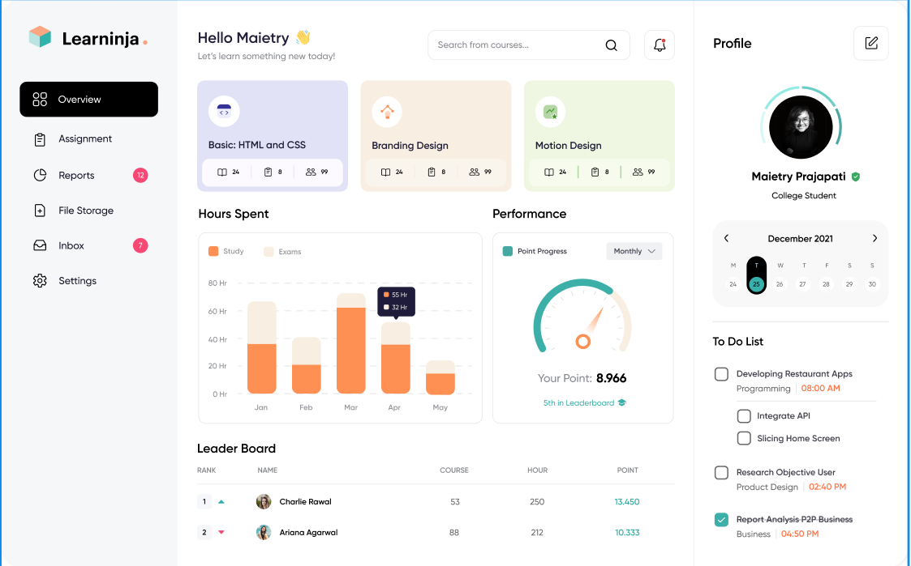

# Referências - Templates do Figma

[LMS Dashboard](https://www.figma.com/design/2eIkPoFL90pUOkms6oYagK/LMS-Dashboard-Concept--Community-?node-id=0-1&p=f&t=AFDf3xr8TxN4dy5b-0)

Gostei da forma como os elementos estão distribuídos no dashboard. Apesar de apresentar uma quantidade significativa de informações, a organização dos componentes faz com que o visual permaneça leve, agradável e fácil de compreender.

Essa referência pode ser utilizada no projeto como inspiração para definir quais informações devem ser apresentadas no dashboard e como distribuí-las pela tela, buscando manter um equilíbrio entre a quantidade de conteúdo e a organização visual.

[Educational Insights](https://www.figma.com/design/hehOiH2BgrmMiSeANTumo8/Educational-Insights-Dashboard--Community-?node-id=838-30217&p=f&t=d7tCM2IEEpoBiVhs-0)

O design deste dashboard é parecido com o primeiro, mas achei que a utilização das cores ficou mais bem estruturada. A forma como elas foram aplicadas cria uma hierarquia visual e direciona naturalmente o olhar do usuário para os elementos de destaque.

Também gostei da barra de pesquisa, que ficou mais aparente e fácil de identificar. No geral, achei o visual bonito e interessante, principalmente pela escolha das cores, que serve como uma boa referência para o meu projeto.